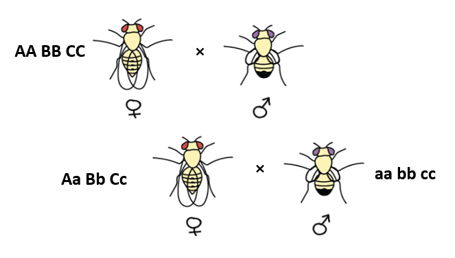

```{r setup, include=FALSE}
library(learnr)
library(rectree)
```

## How and why does recombination vary across the tree of life?

This week's practical will focus on measuring and investigating variation in recombination rate in a dataset of >320 species.

You can work alone or in small groups. We will talk through Exercise 1 together and I will give you about 15 minutes to complete it. We will then move on to Exercise 2, where you should prepare a short report based on the questions.

If you want feedback on your work in this practical, especially if you cannot attend in person, please feel free to send it to me before 5pm on Monday and I'll respond as soon as I can.

**If you are running this locally in RStudio, this tutorial is best viewed full screen. You can do this by clicking "Open in Browser" or "Show in New Window" in the top-left corner of the window.**

## Part 1: Calculating recombination rates.

In this week's lecture, I discussed how recombination was discovered and how the first linkage map was created in *Drosophila melanogaster* by Alfred Sturtevant and Thomas Hunt Morgan, by looking at the co-inheritance of phenotypic polymorphisms. 


This led to the map unit being coined as a centimorgan, where:
**1 centiMorgan = Distance between two markers where 1/100 crossovers are expected.**

This principle of linkage mapping is still used today - we can look at the frequency of recombination between loci that originated from the same haplotype. Often, this depends on using breeding designs, such as crossing inbred lines. Here is an example of a backcross in *Drosophila*:


*Image modified from Madboy74 & Khan Academy*


The recombination frequency (identical to the cM measure) can be calculated as follows:


### Exercise 1. Measuring recombination rates

Investigate the data from this backcross population of *Drosophila* with three genotyped loci, A, B & C. In the parental generation, AA BB CC homozygous flies are crossed with aa bb cc homozygous flies. All F1 flies are Aa Bb Cc and are backcrossed to aa bb cc homozygous flies. With no recombination, we expect only upper or lower case combinations to be inherited e.g. AB or ab. See this example:



The genotypes in 1,000 resulting offspring are:

A-B Geno | Count | | A-C Geno | Count | | B-C Geno | Count
---|-----|-|----|-----|-|----|------
AB | 400 | | AC | 372 | | BC | 310
aB | 92  | | aC | 105 | | bC | 171
Ab | 96  | | Ac | 115 | | Bc | 187
ab | 412 | | ac | 408 | | bc | 332

### Exercise 1: Questions

**1a.** Calculate the cM distances between A & B, B & C and A & C.

**1b.** Draw a map of loci A, B and C relative to one another. Include the centiMorgan distances between all three combinations.

**1c.** The cM distance between the first and last markers is less than the sum of the inter-marker cM distances. Why might this be the case? Why is this less of an issue for markers that are closer together? Explain your answer (~2-3 sentences).

**1d.**  The physical distance between the first and last markers is 43 Mb. Using the sum of the shorter cM distances on the chromosome, calculate the chromosome recombination rate in cM per Mb.


## Part 2. How does recombination rate vary with genome architecture?

By now, you have seen this plot of recombination rate variation across taxa many times. It is from a review on "Variation in recombination frequency and distribution across eukaryotes: patterns and processes" by Jessica Stapley & colleagues (2017). I highly recommend this paper if you want to know more about recombination rate variation - and to better understand this practical - it is available open access [here](https://royalsocietypublishing.org/doi/10.1098/rstb.2016.0455).


The data that made this graph was published along with the paper. It is loaded into this document and includes information on the following:

* `Species` - Latin species name.
* `AnimalPlant` - either "Animals" or "Plants".
* `Genome_Mb` - the physical length of the genome in Megabases.
* `Chr_Count` - Haploid chromosome number (e.g. 23 in humans).
* `MapLength_cM` - the genome-wide linkage map length in centiMorgans.
* `RecRate_cM_Mb` - the genome-wide recombination rate in cM/Mb.

The data can be viewed in the code block below - click the box that says "Run Code" in the top right corner.

```{r explore_data, exercise=TRUE, exercise.lines = 5}
rec_rate
```

The data can be explored with the following two functions:

* `plotLinearRegression()` will plot a scatterplot and linear regression between different `x` and `y` variables. For example, we can plot the recombination rate `RecRate_cM_Mb` as the response variable against `Genome_Mb` as the explanatory variable (NB. For these custom functions, keep the variable names in `""` quotes).

* `runLinearRegression()` takes the same argument for the previous function and returns the results of the linear regressions. This includes the intercept, slope, standard error of the slope, the t-statistic, the P-value and the R-squared value. This last statistic provides a measure of how well the model fits the data.

The functions can be run as follows, converting the data to the **log scale** for ease of analysis:

```{r run_log_regression, exercise=TRUE}
plotLinearRegression(x = "log(Genome_Mb)",
                     y = "log(RecRate_cM_Mb)",
                     dataset = rec_rate)

runLinearRegression(x = "log(Genome_Mb)",
                     y = "log(RecRate_cM_Mb)",
                     dataset = rec_rate)
```

These can also be grouped using the `group` argument. Try using the column "AnimalPlant":

```{r run_regression2, exercise=TRUE}
plotLinearRegression(x = "log(Genome_Mb)",
                     y = "log(RecRate_cM_Mb)",
                     group = "AnimalPlant",
                     dataset = rec_rate)

runLinearRegression(x = "log(Genome_Mb)",
                     y = "log(RecRate_cM_Mb)",
                    group = "AnimalPlant",
                    dataset = rec_rate)
```


### Exercise 2: How does recombination rate vary with genome size?

The variation in recombination rate that we see across taxa is often attributed to the **genome size in Mb** and/or the **haploid number of chromosomes** in the genome.

For this exercise, you will analyse how **recombination map lengths (in cM)** in animals and plants are explained by these factors - and which of the two (if any) explains more variation. 

**Q2a.** Form hypotheses for how you expect map length to vary with (a) Genome Size and (b) Haploid Chromosome Number. Give a brief explanation to justify each hypothesis (1-2 sentences each).

**Q2b.** Use the functions above to test your two hypotheses in Animals and Plants separately, using the `group` argument. A code box is provided below. Write a short text outlining each model, results and interpretation. Include figures to support your findings. Which factor explains more variation in recombination map length in animals and plants? (~200 words).

```{r run_regression3, exercise=TRUE, exercise.lines = 8}


```


